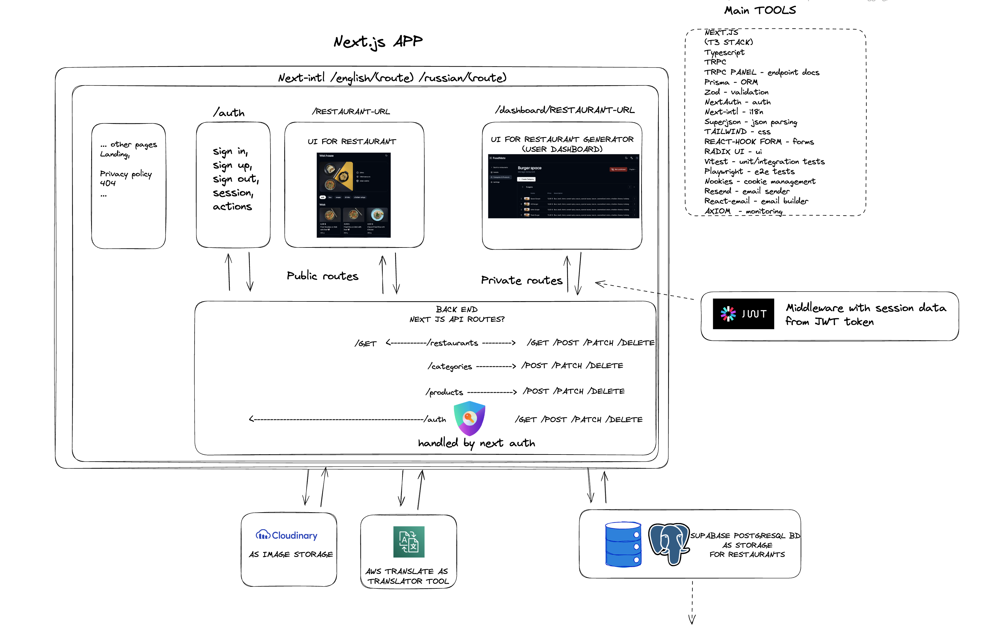

# Scan2Eat app

A digital menu generator for restaurants, built using [T3 Stack](https://create.t3.gg/)

## Before Start

Make sure that you have accounts and api keys for

- [Vercel](https://vercel.com/)
- [AWS](https://aws.amazon.com/ru/console/)
- [Supabase](https://supabase.com/)
- [Cloudinary](https://console.cloudinary.com/)
- [Upstash](https://upstash.com/)
- [Resend](https://resend.com/)

## App schema

the brief system overview

[full schema](https://excalidraw.com/#json=-qdmPKG7kEkGeRNfnAK0A,BRtGwCdeqgK9Pt2-Pw1tEQ)

## Env variables

To check all required env variables please check [env-example](./env.example)

## Database commands

1. pnpm prisma format - format tables schema after changes(spaces,relations)
2. pnpm prisma db push - apply new changes for db (dev)
3. pnpm prisma migrate dev - apply new changes for db (dev), it produces changes between old and new schema
4. pnpm prisma migrate deploy - sync dev/prod tables
5. pnpm prisma db seed - seed initial data

## Email templates commands

- pnpm dev:email - start server to add/edit templates on localhost:3000

## How to run

- pnpm install
- pnpm dev

## How to build

- pnpm build
